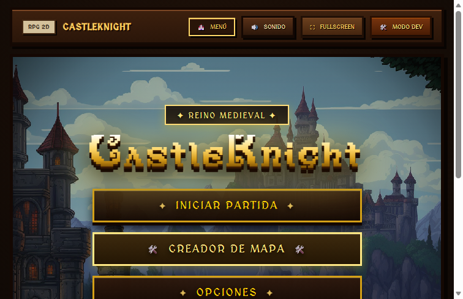
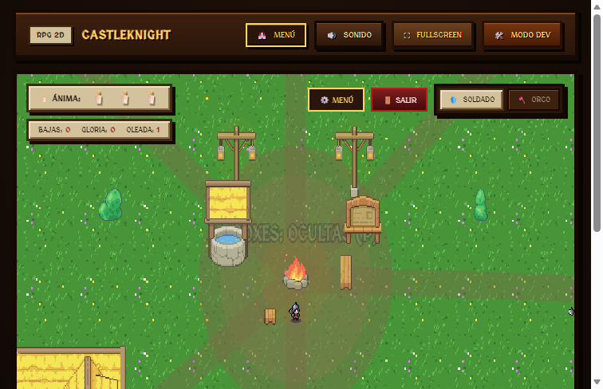
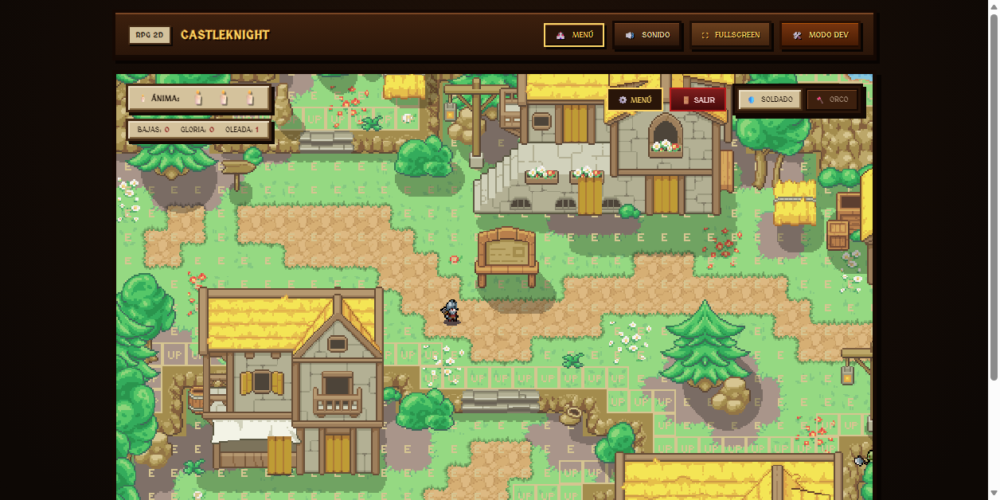
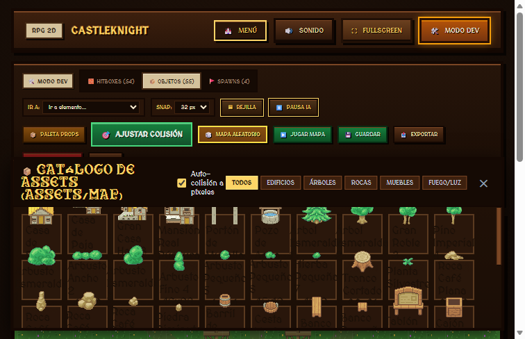

# ⚔️ CastleKnight - 2D Top-Down RPG

[](https://phaser.io/)
[](https://developer.mozilla.org/es/docs/Web/JavaScript)
[](https://developer.mozilla.org/es/docs/Web/HTML)
[](https://nodejs.org/)

Un videojuego RPG de acción en 2D con perspectiva cenital (Top-Down) desarrollado en **Phaser 3**, **HTML5 Canvas** y **JavaScript**. Incluye modos de juego seleccionables, un editor de mapas integrado, combate con animaciones y efectos de sonido en tiempo real.

---

## 📸 Capturas de Pantalla

| Menú Principal con Selector de Modos | Modo de Juego (Combate y HUD) |
| :---: | :---: |
|  |  |

| Renderizado de Capas Tiled | Editor de Mapas Integrado |
| :---: | :---: |
|  |  |

---

## 🗂️ Estructura del código

El código está separado por funcionalidad en `js/core`, `js/config`, `js/maps` y `js/scene`. La guía con el mapa de carpetas y las recetas para agregar, mover o quitar cosas está en [docs/ESTRUCTURA.md](docs/ESTRUCTURA.md). Después de tocar la estructura: `npm run check`.

---

## 🎮 Modos de Juego

1. **Modo Práctica (Tutorial):**
   - Mapa de práctica interactivo con orcos y muñecos de entrenamiento.
   - Ideal para probar controles, combos de ataque y esquivas.
2. **Modo Campaña ("The Kingdom's Outpost"):**
   - Mapa extendido de 80×60 tiles (1280×960 px) creado con 18 tilesets de alta calidad.
   - Incluye ríos, puentes, caminos empedrados, campamento con fogata, bosques y acantilados rocosos.
3. **Editor de Mapas en Tiempo Real:**
   - Herramienta integrada dentro de la interfaz para dibujar, estampar elementos, generar biomas aleatorios y exportar configuraciones personalizadas.

---

## 🕹️ Controles del Juego

| Acción | Tecla / Control |
| :--- | :--- |
| **Moverse** | `W`, `A`, `S`, `D` o Flechas de dirección |
| **Ataque Básico / Combo** | Clic Izquierdo o Barra Espaciadora |
| **Dash / Esquiva** | Shift Izquierdo |
| **Habilidades Especiales** | Teclas `1`, `2`, `3`, `4` |
| **Pausa / Menú** | `ESC` |

---

## 📁 Estructura del Proyecto

La estructura del repositorio está organizada para máxima claridad y facilidad de despliegue:

```text
prueba/
├── assets/                  # Recursos gráficos y multimedia del juego
│   ├── Music/               # Bandas sonoras del juego (IntroSong.mp3, villageSong.mp3)
│   ├── UI/                  # Íconos e interfaces visuales de usuario
│   ├── characters/          # Spritesheets de personajes (Soldado, Mago, Orco, animaciones)
│   ├── font/                # Fuentes tipográficas medievales y pixel-art (Antiquity, Pixuf)
│   ├── intro/               # Video cinemático de fondo y portada de introducción
│   ├── map/                 # Texturas y tilesets del mapa de práctica
│   ├── map2/                # Texturas ("Art/") y mapas Tiled de campaña
│   ├── npc/                 # Personajes no jugables (NPCs) de la aldea
│   └── raw/                 # Recursos originales de diseño (Aseprite, fuentes base)
├── docs/                    # Documentación adicional y capturas
│   └── screenshots/         # Capturas de pantalla de la vitrina y auditorías
├── js/                      # Lógica principal del juego en JavaScript
│   ├── game.js              # Arranque (el resto: js/core, js/config, js/maps, js/scene — ver docs/ESTRUCTURA.md)
│   ├── assets_data.js       # Sprites y configuraciones embebidas en Base64
│   ├── map2_data.js         # Datos del mapa de campaña
│   ├── mapa1_data.js        # Estructura del mapa para modo práctica
│   └── map_assets_base64.js # Tilesets base64 para compatibilidad offline
├── scripts/                 # Herramientas de automatización, generación y pruebas
├── .gitignore               # Exclusión de archivos temporales, logs y dependencias
├── index.html               # Punto de entrada principal y contenedor del juego
├── package.json             # Metadatos del proyecto y scripts NPM
├── README.md                # Documentación del proyecto
├── server.js                # Servidor HTTP local con soporte UTF-8, range requests y MIME
└── styles.css               # Estilos de interfaz de usuario, menús y modales
```

---

## 🚀 Instalación y Ejecución Local

### Prerrequisitos
- [Node.js](https://nodejs.org/) (versión 16 o superior recomendada)

### Pasos para iniciar

1. Clona o descarga este repositorio:
   ```bash
   git clone https://github.com/TU_USUARIO/TU_REPOSITORIO.git
   cd TU_REPOSITORIO
   ```

2. Instala las dependencias necesarias:
   ```bash
   npm install
   ```

3. Inicia el servidor de desarrollo local:
   ```bash
   npm start
   ```

4. Abre tu navegador web en:
   ```text
   http://localhost:3000
   ```

---

## 🛠️ Scripts Disponibles

- `npm start`: Inicia el servidor local en el puerto 3000.
- `npm run generate:map`: Regenera el mapa de campaña `assets/map2/campaign_map.json`.
- `npm run patch:map`: Parchea y sincroniza definiciones de tilesets en `assets/map2/mapa1.json`.

---

## 📤 Cómo Subir este Proyecto a GitHub

Sigue estos sencillos pasos desde la terminal dentro de esta carpeta:

1. **Inicializa Git** (si no lo has hecho aún):
   ```bash
   git init
   ```

2. **Agrega todos los archivos al seguimiento:**
   ```bash
   git add .
   ```

3. **Crea el primer commit:**
   ```bash
   git commit -m "feat: estructura inicial organizada de CastleKnight con modos Campaña y Práctica"
   ```

4. **Configura la rama principal:**
   ```bash
   git branch -M main
   ```

5. **Conecta tu repositorio remoto de GitHub** (crea uno nuevo en github.com):
   ```bash
   git remote add origin https://github.com/TU_USUARIO/NOMBRE_DEL_REPO.git
   ```

6. **Sube tus cambios:**
   ```bash
   git push -u origin main
   ```

---

## 📄 Licencia

Este proyecto está bajo la Licencia ISC. Consulta los archivos fuente para más detalles sobre assets y atribuciones.
